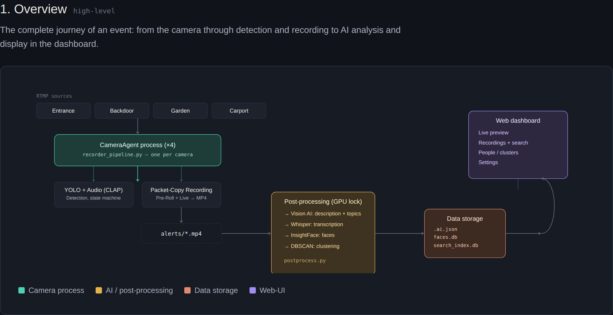

# IDguard PRO


IDguard PRO watches your cameras, decides what's actually worth recording, saves the event, and — if you want — tells you afterwards in plain words what happened in it, who was in it, and what was said, in a way you can later search back through. It does that by chaining several small, specialized models together instead of expecting one AI to handle it all: a YOLO model (v10, v12, or v26 — your choice) watches every frame live and spots the moment something worth recording is happening; an audio model (CLAP) can independently trigger a recording on a sound alone, even with nothing visible in frame; the recording itself then saves the event with a short buffer before and after; a vision-language model (via Ollama) looks at the finished clip afterwards and writes a description of what it saw, plus an optional yes/no read on categories you define yourself; a local Whisper model transcribes anything spoken; a face-recognition model groups and (once you name a few) recognizes who's in frame; and a small text-embedding model makes all of that searchable by meaning, not just exact words. Each model only does the one job it's good at, and the handoff between them is automatic. Everything runs on your own hardware, with GPU acceleration end to end — decoding and detection — no cloud involved.

Parts of this code were written with AI (Google Gemini, Claude, Claude Code, and local models). But the architecture — deciding how the pieces should fit together, and the work of actually making it all run reliably — was still a person's job.



[→ Full detailed architecture](ARCHITECTURE.html)

## Why IDguard PRO, instead of Motion or Frigate?

Short answer: it depends what you want, and it's worth being honest about that up front rather than oversell.

**[Motion](https://motion-project.github.io/) / [MotionEye](https://github.com/motioneye-project/motioneye)** trigger on pixel differences between frames. That's the classic approach, it's been reliable for decades, and it genuinely doesn't know *what* changed — a cloud shadow, headlights, a moth near the lens, and an actual intruder all look the same to it: "pixels changed." IDguard PRO's whole starting point was replacing that with an actual object detector as the trigger, so a recording only starts when something you've told it to care about is actually there.

**[Frigate](https://frigate.video/)** is the closer, and frankly more mature, comparison — it already does AI object detection as the trigger, and (worth saying plainly, since getting this wrong once already taught me to check before writing it down) its recent versions have their own semantic search (CLIP/Jina embeddings), generative-AI scene descriptions, speech transcription (Whisper), *and* face recognition — functionally overlapping with most of what's described below. Frigate is also a considerably bigger and more mature project: license plate reading, a much wider hardware-acceleration matrix (Coral, Hailo, Intel iGPU, Apple Silicon, NVIDIA), an active community, and a paid model fine-tuning service if the stock accuracy isn't enough for you.

So the honest positioning isn't "does things Frigate can't." Most of what's below, Frigate can also do at this point, often with a bigger community behind it and more hardware options. What's genuinely different is more about shape than capability:

* **Audio as an independent trigger, not just an enrichment.** CLAP listens continuously and can start a recording on sound alone — with nothing in frame — matched against categories you type yourself (`glass breaking`, `whispering`, `drawer opening`, whatever), not a fixed pretrained class list. Frigate's audio features are closer to detection-and-transcription of what's already being recorded rather than an independent *trigger source* in this specific sense — worth checking their current docs if this distinction matters to you, since this space moves fast.
* **User-defined topic classification.** Beyond describing a scene, you can hand the vision model your own categories — `break-in`, `accident`, `mail carrier` — and get a yes/no-with-confidence read per category, saved to sidecar metadata and searchable.
* **A one-line "why did this trigger" readout** on every recording — which detector fired, what it saw, at what confidence, whether it was the camera or the microphone — instead of having to infer it from the clip itself.
* **The models are wired into each other, not just running side by side.** The scene-description prompt is built dynamically around your actual YOLO detection classes and topic categories, so the vision model writes toward what you're actually watching for instead of a generic room description. Search matches against description, topics, transcript, and recognized people as one combined signal, not four separate lookups. The trigger readout above pulls from whichever detector actually fired, vision or audio, rather than only ever describing what the camera saw. None of this is a hard technical wall other similarly-scoped projects couldn't also build — it's a design choice we made and kept fixing until it actually held together end to end, worth mentioning because it's easy to bolt multiple AI features onto a pipeline without them actually informing each other.
* **A single-box, GPU-heavy design point.** Built and tuned around one well-specced GPU (RTX 2060 through RTX 5090) rather than spreading detection across many cheap accelerators — the right trade-off if you already have a capable box and would rather not manage a Coral/Hailo fleet.
* **Small enough to read start to finish.** No plugin ecosystem, no paid tier, no protocol integrations to reason about — if you want to know exactly what a self-hosted camera pipeline is doing with your video, there's a lot less of it to read here than in a project with years of accumulated features.

If you want a mature, broadly-hardware-compatible NVR with a big feature set and a real community behind it, Frigate is very likely the better choice today — including for face recognition and transcription specifically, where it now has a head start on real-world testing. If you want the smaller, single-purpose version of the same idea, tuned around one strong GPU rather than a device fleet — that's what this is for.

## Overview

The core mission of IDguard PRO is to act as an intelligent edge-computing sentinel. Unlike traditional motion-detection systems that trigger on any pixel change, IDguard PRO uses deep learning to identify specific objects — people, vehicles, animals, packages, or any other COCO class — and only initiates recording when a high-confidence detection occurs. This significantly reduces storage requirements and eliminates false positives caused by wind, shadows, or animals (unless you want those too — detection classes are fully configurable).

## Key Features

### Camera Input
* **RTMP, RTSP, MJPEG, and local USB/V4L2 webcams** (`/dev/video0` etc.) — just point a camera's URL field at any of these, no separate configuration needed. RTSP connections use TCP transport by default (more robust against packet loss than the ffmpeg default of UDP).
* **Automatic recording-path selection per camera:** cameras whose source codec plays back reliably in a browser (H.264, VP9, AV1) are recorded via packet copy — the already-compressed stream is written straight to disk, no re-encoding, ~1000× cheaper per frame. Cameras that don't (MJPEG, most raw USB webcam feeds) are recorded via real encoding instead (NVENC-accelerated where available, software fallback otherwise) — a bit more GPU/CPU cost, but the only way to get a file that actually plays back afterward. Decided automatically per camera at connection time; nothing to configure.
* **Watchfolder Import (optional):** point IDguard PRO at a folder instead of a camera, and it treats every video file dropped in there (from a phone backup, an old NVR export, a network share, anywhere) as a finished recording — waits for the file to stop growing, then imports it: renamed into the standard naming convention, filmstrip generated, and run through the same AI post-processing as a live camera event. Off by default.
* **Automatic playback-codec fix on import:** if an imported file's video codec won't play reliably in a browser (HEVC/H.265 being the common offender — technically valid, but most non-Safari browsers ship without a licensed decoder for it), it's transcoded to H.264 automatically before it lands in the dashboard — GPU-accelerated decode and encode where available (`-hwaccel cuda` + NVENC), software fallback otherwise. Audio is left untouched (copied, not re-encoded); already-compatible video (H.264, VP9, AV1) is only re-wrapped into an `.mp4` container if needed, never needlessly re-encoded.

### Detection & Recording
* **Switchable AI Backends:** YOLOv10, YOLOv12, and YOLO26, selectable per deployment (see model comparison below), with model size from Nano to Extra Large.
* **Event-Driven Recording:** Automatic MP4 recording triggered by detection, with configurable pre-roll and post-roll buffers to capture the arrival and departure of subjects.
* **Zero-Overhead Recording (where possible):** for cameras with a browser-compatible codec (H.264, VP9, AV1 — the vast majority of RTMP/RTSP IP cameras), recordings are written via packet copy — the already-compressed stream from the camera is copied directly into the output file, no re-encoding involved. Roughly 1000× cheaper per frame than a traditional encode-based recorder, and output quality is exactly what the camera itself produces. Cameras with an incompatible source codec (MJPEG, most USB webcams) fall back to real encoding automatically — see Camera Input above.
* **"Why did this trigger" readout:** every recording shows a one-line summary of what actually caused it — object class and confidence from the vision model, and/or the matched category and confidence from the audio trigger — right in the dashboard, not something you have to guess from the clip.
* **Live Detection-Box Overlays:** Optionally see exactly what the model sees, in real time — bounding boxes (color-coded per class) drawn directly into the camera grid previews and the live-view lightbox, reusing the inference the pipeline already runs (no extra GPU cost). Toggle in Settings → Display.
* **Trigger Screenshots:** Every recording gets an automatic screenshot with the detection box drawn in, taken at the trigger frame, plus a small confidence/class badge (e.g. "person 87%") shown right on the thumbnail in the dashboard.
* **Configurable Filmstrip Thumbnails:** A configurable number of small + large preview frames captured across the *entire* event — using reservoir sampling plus a guaranteed final-frame slot, so even a long-running event still gets frames spread across its full length and never loses coverage of how it ended. The small frames (with detection boxes, for humans) power a hover-to-scrub filmstrip preview (works on touch too); the large frames (kept raw/unannotated, for cleaner AI input) are sized for feeding into a vision AI.
* **Resilient by Design:** Cameras that crash or disconnect auto-restart with the same config. If the AI model fails to load (e.g. a transient GPU/driver hiccup), the pipeline keeps retrying in the background instead of silently going blind.
* **GPU-Aware Startup:** Detects the installed GPU (Turing through Blackwell) and automatically determines whether FP16 and cuDNN are safe to use, with a staged self-test and fallback — same codebase runs unmodified from an RTX 2060 up to an RTX 5090.
* **Accurate Timing:** Frame timestamps are wall-clock based rather than a fixed frame counter, so a brief network stall shows up as a natural pause in the recording instead of the rest of the clip playing back too fast.
* **Race-Safe Model Download:** The YOLO checkpoint auto-downloads on first run via an atomic, per-process temp-file + rename, with a timeout and a minimum-size sanity check — safe even though multiple processes (master, every camera worker, the dashboard) import the same config module concurrently.

### Optional AI Scene Description & Topic Classification (Ollama)
* After a recording finishes, IDguard PRO can optionally hand the large filmstrip frames to a locally hosted **Ollama** vision model and have it describe what happened in the clip in plain language.
* **Detection-aware description:** the scene-description prompt isn't generic — it's built dynamically around what your YOLO setup is actually configured to watch for (e.g. "Person, Dog, Car"), asking the vision model to weight its description toward those specific objects and their behavior rather than just describing the room. Your configured topic categories are folded into the same prompt, so description, topic classification, and detection targets stay in sync instead of running as three independent, disconnected passes.
* **Topic classification:** define your own categories in Settings — `break-in`, `accident`, `mail carrier`, anything — and the vision model gives each a 0–100 match score for the scene. All categories above your threshold are shown next to the description (not just the top one), saved into the sidecar metadata (including as searchable XMP keywords), and semantically searchable. Worth saying plainly: this score is the model's own self-reported guess via a prompt, not a calibrated probability like the detection confidence elsewhere in the pipeline — treat it as a useful sort/filter signal, not a certainty.
* **Model picker with tested presets** in Settings, plus a free-text "Custom model…" option for anything else pulled into Ollama. Note: Ollama has no native video-file input — every model, regardless of which one you pick, receives the same image sequence (the filmstrip frames), never the raw video.
* A **live Ollama-connectivity badge** in Settings shows at a glance whether the configured endpoint is reachable, so a misconfigured URL or a down container is visible without needing to open a terminal.
* The result is written both as a small JSON file (shown directly in the dashboard, next to Recent Recordings and Archive) and as an XMP sidecar file for compatibility with photo/video managers like **Immich**.
* A manual **re-analyze button** per recording (also re-runs transcription and face recognition if those are enabled — one button re-triggers everything post-processing–related for that event) and a visible "Analyzing…" state while it's running.
* Fully optional and off by default — no Ollama instance required unless you turn it on.

### Audio Trigger (CLAP)
* Optionally triggers a recording purely from **sound**, independent of visual detection — useful for anything that happens outside a camera's field of view or in the dark.
* Uses [CLAP](https://github.com/LAION-AI/CLAP), which compares live audio directly against **freely typed text categories** rather than a fixed class list — type `whispering`, `glass breaking`, `drawer opening`, or anything else you want to listen for, any number of categories active at once.
* Runs in its own background thread per camera — the (comparatively slow) audio classification can never block or delay the recording pipeline itself, even on a slow or missing GPU.
* Off by default; enabling/disabling and editing categories takes effect live, no restart needed.

### Speech Transcription (Whisper)
* Transcribes spoken audio from each recording using a locally-run [faster-whisper](https://github.com/SYSTRAN/faster-whisper) model (`tiny` through `large-v3`, selectable in Settings) — separate from the audio trigger above, since CLAP only recognizes sound *categories* ("whispering"), not actual words.
* GPU-accelerated with automatic CPU fallback; language auto-detected by default, or pinnable in Settings.
* Runs as part of the same post-recording pipeline stage as the AI description and topic classification — all three are coordinated to run one after another (not in parallel) specifically so they can't clobber each other's entry in the same sidecar metadata file.
* Transcript is saved to the sidecar metadata and is semantically searchable, exactly like the AI description.
* Off by default.

### Face Recognition (InsightFace)
* Detects faces in each recording (on the same filmstrip frames the AI description stage already uses — no extra frame extraction), extracts a face embedding per detection, and automatically matches it against any already-named people.
* **Model pack is your choice** in Settings: `buffalo_s` (fastest) up through `buffalo_l`, or `antelopev2` (largest). All via [InsightFace](https://github.com/deepinsight/insightface), running fully locally.
* Faces that don't match anyone yet are grouped by **DBSCAN clustering** (cosine distance over the face embeddings) — no need to tell it how many people to expect in advance, and it won't force an odd one-off face into a group it doesn't belong in.
* A dedicated **People** section in the dashboard shows named people (with a representative photo and face count, click to expand and review every face assigned to them) and any newly-clustered, not-yet-named groups you can name or merge into an existing person.
* **Fully correctable, at the individual-face level** — a wrongly grouped photo can be pulled out of a person (goes back into the unlabeled pool) without affecting the rest of that person's faces, and a false detection (something that isn't actually a face) can be rejected outright so it stops showing up anywhere.
* **Ignorable groups:** unlabeled clusters that aren't useful (blurry crops, false groupings) can be hidden from the main view with one click — nothing is deleted, just tucked away behind a "Show ignored clusters" toggle.
* Off by default.

### Semantic Search
* A search bar over Recent Recordings finds events by their AI-generated descriptions, detected topics, transcribed speech, **and named people** — matching a query against face-recognition names too, so searching "Axel" surfaces every recording he was identified in, mixed in with text/topic/transcript matches, both by exact text match and by **meaning**, so "person carrying a box" also finds a description that says "individual holding a package."
* Semantic matching is powered by a small local sentence-embedding model (`all-MiniLM-L6-v2`), stored in a lightweight SQLite index — no external vector database needed at the scale a self-hosted camera system runs at.
* Falls back to plain text search automatically if the embedding model isn't installed — search stays usable either way.
* Search results mix current and archived recordings in one list, each still fully actionable (archive/delete/re-analyze/export) from the results themselves.
* **Archive has its own dedicated search bar**, scoped to archived recordings only, running on the same combined description/topic/transcript/people matching.

### Daily & Weekly Summaries
* Generates a short, natural-language recap of a day's or week's events ("two packages delivered, the dog let out once, nothing unusual") from the already-existing AI descriptions — a pure text-summarization task, reusing the same Ollama endpoint, no new model or infrastructure.
* Triggered from the dashboard, or automatable with a cronjob — an example crontab entry is shown directly in the Summaries card.

### Home Assistant / MQTT (optional)
* Publishes a per-camera "Recording" motion-style sensor (on while a recording is in progress) and a "Last Event" sensor with the AI description, to any MQTT broker.
* With Home Assistant MQTT Discovery enabled (default), entities appear automatically — no YAML required.
* Deliberately fire-and-forget: publishing runs on its own background thread, so an unreachable or slow broker never delays or affects recording. Off by default. See [HOME_ASSISTANT.md](./HOME_ASSISTANT.md) for setup and example automations.

### Anomaly Detection (optional)
* Flags recordings whose AI description is a statistical outlier compared to that camera's own recent history — "this doesn't look like what usually happens here" — without needing to know in advance what you're looking for.
* Built on an Isolation Forest per camera, reusing the semantic-search embedding that's already computed for every event (see Semantic Search above) — no new model, no extra GPU cost, no new dependency (scikit-learn is already used for face clustering).
* Needs a baseline: train from the dashboard's Anomaly Detection card (or via cron), which requires at least 15 analyzed recordings for that camera in the lookback window (default 30 days). Cameras with less history are skipped, not force-trained on too little data.
* Flagged recordings get `anomaly: true` and a score written to their metadata. Off by default — training always works regardless, but tagging only happens once explicitly enabled in Settings.

### Export
* Bundles a recording — video, trigger screenshot, all sidecar metadata (AI description, topics, transcript, XMP), and the full filmstrip folder — into one clearly named folder: `Event_<Camera>_<Timestamp> Topic_<Topic>` (the topic suffix only appears if one was detected).
* Destination is one setting: a **local path** copies directly, a **remote `user@host:/path`** uses `rsync` instead. Remote export assumes passwordless SSH key access is already set up between the two machines — this can't configure that part for you.
* Off by default (no Export button shown) until a destination is configured in Settings.
* Blocked automatically while a recording is still in progress — archiving or exporting a file mid-write isn't allowed, to avoid moving a file the recorder still has open.

### Web Dashboard
* **CCTV-style layout:** a slim pipeline control bar up top, live camera previews and Recent Recordings front and center, with Settings, Hardware/System Status, People, Log, and Archive tucked into collapsible sections out of the way.
* **Cameras managed entirely in the dashboard:** add, edit, or remove cameras (name + URL — RTMP, RTSP, MJPEG, or a local `/dev/videoX` device) from Settings → Cameras — no more hand-editing `config.py` to change your camera list.
* **Live previews:** per-camera thumbnails and a full live view, with a configurable refresh rate (0.5–5 fps slider, applied live without a page reload) — disabled or unreachable cameras simply show nothing instead of flickering broken-image icons, and a camera not enabled for recording shows no REC indicator in the grid.
* **REC indicators everywhere:** a live badge on any camera thumbnail currently recording, plus the browser tab title itself switches to "🔴 REC · IDguard PRO" while any camera is active — visible even from a background tab.
* **"Last active" per camera:** each camera in the live-preview grid shows a relative timestamp of its most recent recorded event.
* **Card-style recording thumbnails:** large preview images in Recent Recordings and Archive, including recording duration once a clip has finished — enough to actually recognize what happened at a glance, not a tiny icon.
* **In-dashboard log viewer:** the last 100 lines of the pipeline log, collapsible, auto-refreshing only while open.
* **Archive workflow:** archive recordings you want to keep permanently, separate from the auto-cleanup pool; deleting, archiving, or exporting carries thumbnails, filmstrips, and all metadata along automatically.
* **Auto-retention:** optionally delete un-archived recordings older than N days; archived recordings are never touched by auto-cleanup.
* **Day-grouped recording lists** with clear separators, and a "load older" control once a list passes 200 entries.
* **Hardware status at a glance:** CPU, RAM, VRAM, GPU temp, disk space, and NVENC/NVDEC utilization, all live-polled.
* **Dark and Day themes**, switchable in Settings.
* **CSRF-protected, non-blocking:** settings changes and pipeline restarts run in the background — the UI stays responsive during a restart instead of freezing.
* **Resource-conscious:** the dashboard's live previews share frames with the recording pipeline's own decode instead of opening a second, redundant connection per camera whenever the pipeline is running.
* **`/health` endpoint + watchdog script** for external monitoring — pair with a cron job to auto-restart the dashboard if it ever goes unresponsive.

### Utilities
* **`backfill_thumbnails.py`:** grabs a frame (via ffmpeg) for older recordings from before the thumbnail feature existed — no detection boxes possible for these (the original inference data is long gone), but at least a visual reference instead of a blank entry.
* **`backfill_filmstrips.py`:** extracts filmstrip frames (via ffmpeg, evenly spread across the actual video length) for older recordings that predate the filmstrip feature — same format as live-captured filmstrips, so hover-scrub and AI analysis work on them too. Optional `--analyze` flag chains straight into `ai_analyze.py` per video.
* **`backfill_search_index.py`:** indexes any existing `.ai.json` descriptions into the search database — for descriptions generated before the search feature existed, or after rebuilding the index.
* **`cluster_faces.py`:** runs the DBSCAN face-grouping pass on demand (also available as a button in the dashboard's People section) — matches unassigned faces against known people first, then groups whatever's left.

None of these touch the live pipeline — safe to run anytime, and safe to re-run (they skip anything already processed).

## YOLO Model Comparison

IDguard PRO lets you switch the detection backend per deployment. Here's how they differ:

| Model | Best for | Architecture | Trade-offs |
| :--- | :--- | :--- | :--- |
| **YOLOv10** | Lean, predictable real-time detection | NMS-free end-to-end detection (pioneered the approach), dual-label assignment | Lower peak accuracy than v12/26, but very consistent latency — no NMS post-processing step to add jitter |
| **YOLOv12** | Maximum accuracy, GPU headroom to spare | Attention-centric design (Area Attention + R-ELAN) instead of pure CNN | Higher VRAM use and slower CPU throughput than v10/26; still relies on NMS + DFL; Ultralytics itself recommends v11/v26 over v12 for most production workloads |
| **YOLO26** | Best all-round default, especially on constrained hardware | Natively end-to-end (NMS-free, like v10) *and* removes Distribution Focal Loss (DFL) entirely — a simplification neither v10 nor v12 has | Up to ~43% faster CPU inference than the previous Ultralytics generation, deployment-first design; newest of the three, so less battle-tested in the wild |

**Rule of thumb:** YOLO26 is the sensible default for most setups. Reach for YOLOv10 if you want the simplest, most predictable latency profile. Reach for YOLOv12 only if you have GPU headroom to burn and accuracy matters more than efficiency.

## Face Recognition Model Comparison

| Model Pack | Best for | Trade-offs |
| :--- | :--- | :--- |
| **buffalo_s** | Fastest, lowest resource use | Smallest detection/recognition backbone — fine for well-lit, front-facing faces; may miss more at odd angles or in poor light |
| **buffalo_m** | Balanced default | Middle ground on speed vs. accuracy |
| **buffalo_l** | Best accuracy of the buffalo packs | Larger models, more compute per frame |
| **antelopev2** | Highest accuracy overall | Largest and slowest of the four; also the only pack with a known packaging quirk (its release archive unpacks into a nested folder InsightFace's own loader doesn't expect) — IDguard PRO detects and fixes this automatically on first load, but it's a good example of why this pack needs a bit more patience on first run |

## Hardware Requirements

* **GPU:** NVIDIA GPU with CUDA 12.8+ support recommended (RTX 20-series through 50-series). The pipeline auto-detects capability and degrades gracefully (FP16/cuDNN on/off) rather than requiring a specific generation — see [Tested Hardware](#tested-hardware--configurations) below.
* **OS:** Linux-based distribution (Ubuntu recommended).
* **Memory:** Minimum 8GB RAM (higher recommended for multiple simultaneous streams).
* **Storage:** Sufficient space for MP4 event recordings, filmstrip thumbnails, and (if archiving) long-term keepers. Auto-retention can cap unarchived storage growth automatically.
* **Optional:** A locally hosted [Ollama](https://ollama.com) instance with a vision-capable model, if you want AI scene descriptions or topic classification. `llava` is the most broadly reliable choice (classic CLIP-based architecture); newer vision models vary in Ollama compatibility by build — the Settings page shows a live reachability check to help catch a broken model/endpoint quickly. See Settings → AI Video Analysis for the pull command and VRAM budget.

## Tech Stack

* **Language:** Python 3.x
* **Inference Engine:** PyTorch with CUDA support
* **Computer Vision:** Ultralytics (YOLOv10 / YOLOv12 / YOLO26), OpenCV, PyAV
* **Video I/O:** PyAV/ffmpeg — NVDEC hardware-accelerated decoding; packet-copy recording where the source codec allows it, GPU-accelerated real encoding (NVENC) as an automatic per-camera fallback otherwise
* **Web Framework:** Flask
* **Optional AI Analysis:** [Ollama](https://ollama.com) (any vision-capable model — `llava` recommended as a reliable default, with a model picker for others)
* **Optional Audio Trigger:** [CLAP](https://github.com/LAION-AI/CLAP) (`laion/clap-htsat-unfused`, via `transformers`)
* **Optional Speech Transcription:** [faster-whisper](https://github.com/SYSTRAN/faster-whisper)
* **Optional Face Recognition:** [InsightFace](https://github.com/deepinsight/insightface) (buffalo_s/m/l, antelopev2) + `onnxruntime`, with `scikit-learn` (DBSCAN for clustering, Isolation Forest for anomaly detection)
* **Optional Semantic Search:** `sentence-transformers` (`all-MiniLM-L6-v2`) with a SQLite index for storage
* **Export:** Local filesystem copy or `rsync` for remote destinations
* **Process Management:** Threading, multiprocessing, and subprocess modules

## Installation

Detailed installation steps, including virtual environment setup and dependency management, are provided in the accompanying [INSTALL.md](./INSTALL.md) file. A Docker-based install is also available — see [DOCKER.md](./DOCKER.md). For Home Assistant / MQTT integration, see [HOME_ASSISTANT.md](./HOME_ASSISTANT.md).

## Project Structure

* `web_ui.py`: Flask web dashboard — routes, settings, camera management, event/thumbnail/filmstrip serving, log/health endpoints, Ollama connectivity check, search API, export, People (face recognition) API.
* `recorder_pipeline.py`: Core detection and recording logic — one process per camera, GPU-aware startup, packet-copy recording, filmstrip capture, shared live-preview frames, optional detection-box overlays, audio-trigger integration.
* `watch_folder.py`: Optional folder-based import — its own background process, watches a configured folder for finished video files, transcodes to a browser-compatible codec if needed, and feeds them into the same post-processing pipeline as a live recording.
* `daily_summary.py`: Optional daily/weekly narrative summary generator — gathers existing AI descriptions for a time period and asks Ollama to summarize them in plain language. Callable from the dashboard or via cron.
* `mqtt_client.py`: Optional MQTT / Home Assistant integration — publishes per-camera recording state and event summaries, with Home Assistant MQTT Discovery. Fire-and-forget, never blocks the recording pipeline.
* `anomaly_detection.py`: Optional per-camera anomaly detection (Isolation Forest over the existing search embeddings). Callable from the dashboard or via cron; tagging in `.ai.json` only happens once enabled in Settings.
* `postprocess.py`: Entry point for all post-recording processing — runs AI description/topics, transcription, and face recognition sequentially (not in parallel) for a finished recording, specifically so none of them race on the same sidecar metadata file.
* `ai_analyze.py`: Optional post-recording AI scene analysis and topic classification via Ollama; prompt is built dynamically around configured detection classes and topics; writes dashboard metadata + Immich XMP sidecar; indexes the description and topics for search.
* `audio_trigger.py`: Optional CLAP-based audio trigger — runs in its own background thread per camera, never blocks recording.
* `transcribe_audio.py`: Optional Whisper-based speech transcription of a finished recording's audio track.
* `face_recognize.py`: Optional face detection + embedding extraction (InsightFace) on a finished recording's filmstrip frames, with automatic matching against already-named people.
* `faces_db.py`: SQLite storage for detected faces, named people, their centroid embeddings, and ignored-cluster state.
* `cluster_faces.py`: On-demand DBSCAN grouping of unassigned faces (also triggerable from the dashboard's People section).
* `search_index.py`: SQLite-backed search index — full-text + semantic (sentence-transformers) matching over AI descriptions, topics, and transcripts.
* `backfill_thumbnails.py`, `backfill_filmstrips.py`, `backfill_search_index.py`: Standalone utilities to retroactively generate thumbnails/filmstrips/search entries for older recordings.
* `helpers.py`: Shared utilities for the dashboard — settings/override I/O, live-preview frame handling (reuses the pipeline's own decode when it's running).
* `config.py`: System-wide configuration, race-safe model auto-download, and defensive settings validation. Camera list lives in `streams.json` (dashboard-managed), not here.
* `templates/dashboard.html`, `static/style.css`, `static/style-light.css`, `static/favicon.svg`: The dashboard UI, in dark and day themes.
* `start_detached.sh`, `stop.sh`: Pipeline lifecycle scripts with duplicate-instance and graceful-shutdown handling, correctly terminating every camera worker process (not just the master).
* `watchdog.sh`: Optional cron-friendly health check + auto-restart for the web dashboard.
* `Dockerfile`, `docker-compose.yml`: Optional containerized setup — see [DOCKER.md](./DOCKER.md).
* `alerts/`: Recorded event MP4s, trigger screenshots + confidence metadata, and filmstrip/AI metadata (auto-generated), including detected face crops. Includes an `archive/` subfolder for permanently kept recordings.
* `logs/`: Application and system logs for debugging and auditing — also viewable directly in the dashboard.
* `search_index.db`, `faces.db`, `streams.json`, `pipeline_settings.json`, `stream_overrides.json`: Local, gitignored runtime data — camera list, live settings, and the search/face databases.

## Tested Hardware & Configurations

The system has been thoroughly tested and runs rock-solid across both compact edge/SFF builds and high-end workstations — the GPU-aware startup (FP16/cuDNN auto-detection with fallback) means the same codebase runs unmodified on both ends of this range:

| System | Specs | Buffer Settings | Status |
| :--- | :--- | :--- | :--- |
| **Intel NUC 11 Enthusiast** | 32 GB RAM \| NVIDIA RTX 2060 (6 GB VRAM) | 4 streams 30 FPS FullHD / Pre-roll: 5s / Post-roll: 10s | Stable |
| **High-End Workstation** | Intel Core Ultra 9 285K \| 64 GB RAM \| NVIDIA RTX 5090 (32 GB VRAM) | 8 streams 30 FPS FullHD / Pre-roll: 10s / Post-roll: 30s | Stable |

---

## Acknowledgements & Citation

This project utilizes [YOLOv10](https://github.com/THU-MIG/yolov10), [YOLOv12](https://github.com/sunsmarterjie/yolov12), and YOLO26, and is powered by the [Ultralytics](https://github.com/ultralytics/ultralytics) framework for real-time object detection. Optional scene analysis and topic classification are powered by [Ollama](https://ollama.com), optional audio triggering by [CLAP](https://github.com/LAION-AI/CLAP), optional speech transcription by [faster-whisper](https://github.com/SYSTRAN/faster-whisper), optional face recognition by [InsightFace](https://github.com/deepinsight/insightface), and optional semantic search by [sentence-transformers](https://www.sbert.net/).

If you use this repository, please consider citing the original YOLOv10 paper:

```bibtex
@article{wang2024yolov10,
  title={YOLOv10: Real-Time End-to-End Object Detection},
  author={Wang, Ao and Chen, Hui and Liu, Lihao and Chen, Kai and Lin, Zijia and Han, Jungong and Ding, Guiguang},
  journal={arXiv preprint arXiv:2405.14458},
  year={2024}
}
```

## Disclaimer

This software is intended for educational and private security purposes. Users are responsible for ensuring that their use of surveillance technology — including the optional AI scene-description, topic-classification, speech-transcription, and face-recognition features — complies with all local, regional, and international laws regarding privacy and data protection. Face recognition and speech transcription in particular carry meaningfully higher privacy stakes than object detection alone; check what your jurisdiction requires (consent, signage, retention limits) before enabling them.
